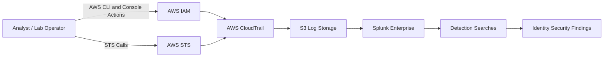

# AWS IAM Abuse Detection Lab

## Overview

This project is a focused AWS identity security lab for understanding how IAM activity appears in CloudTrail and how those events can be analyzed in Splunk. It addresses a common cloud security problem: many high-impact AWS attacks begin with identity enumeration, role assumption, policy changes, or failed privilege attempts, but those behaviors are easy to miss without structured log analysis.

The lab simulates IAM-related activity in a controlled AWS environment, collects the resulting CloudTrail events, and builds Splunk searches for identity-focused detection. It complements broader cloud infrastructure monitoring by concentrating specifically on users, roles, policies, STS activity, and access-control failures.

The final result is a practical detection workflow that shows how IAM actions can be turned into security signals for cloud security analysts, SOC analysts, and detection engineers.

## Key Features

- Created a controlled AWS IAM lab environment for identity activity analysis.
- Generated CloudTrail events for IAM user creation, policy changes, role assumption, and enumeration.
- Simulated resource discovery with AWS CLI and console activity.
- Ingested CloudTrail JSON logs into Splunk for centralized searching.
- Parsed nested CloudTrail records with `spath` and `mvexpand`.
- Built detection searches for IAM administrative actions, role assumption, failed API calls, and identity enumeration.
- Documented findings about high-value IAM signals and multi-service visibility requirements.
- Added screenshots showing IAM user, policy, and role activity created during the lab.

## Architecture

The lab uses AWS IAM as the activity source, CloudTrail as the audit log source, S3 as the log storage layer, and Splunk Enterprise as the SIEM analysis layer. Simulated identity actions produce CloudTrail events, which are then searched in Splunk to identify suspicious or high-risk IAM behavior.

## Tools & Technologies

### Cloud / Infrastructure

- AWS IAM
- AWS STS
- Amazon S3
- AWS CloudTrail

### Security Tools

- Splunk Enterprise
- Splunk Search Processing Language
- CloudTrail event history

### Programming / Scripting

- AWS CLI
- JSON log parsing
- Splunk SPL searches

### Monitoring / Logging

- CloudTrail IAM and STS events
- S3-based CloudTrail log storage
- Splunk indexed CloudTrail records

### Automation / CI/CD

- No CI/CD pipeline is included in this lab

## Security Concepts Demonstrated

This project demonstrates identity-focused cloud detection engineering. It shows why IAM events are high-value signals in AWS: they reveal who is making changes, what privileges are being used, what access failed, and whether an identity is performing discovery before attempting a more impactful action.

The lab also demonstrates how role assumption can represent a privilege boundary change. `AssumeRole` events are especially important because they show when temporary credentials are issued and which identity initiated the action.

The Splunk portion demonstrates practical SIEM work: ingesting CloudTrail logs, parsing nested JSON, writing searches, and turning raw identity events into meaningful security findings.

## Implementation Steps

1. Created IAM lab users, roles, and policies in AWS.
2. Simulated identity enumeration using actions such as listing users and roles.
3. Verified caller identity with AWS STS.
4. Simulated resource discovery by listing S3 buckets and describing EC2 resources.
5. Assumed a lab role using AWS STS to generate role assumption telemetry.
6. Performed administrative IAM activity, including user and policy changes.
7. Collected the resulting CloudTrail logs.
8. Ingested CloudTrail JSON records into Splunk.
9. Parsed the `Records` array structure with `spath` and `mvexpand`.
10. Built Splunk searches for user creation, user deletion, role assumption, failed API calls, and identity enumeration.
11. Documented key findings and lessons learned from the generated telemetry.

## Results / Findings

The lab produced CloudTrail events for IAM enumeration, resource discovery, role assumption, user creation, policy creation, and policy attachment. These events were analyzed in Splunk to identify identity activity that would be useful for cloud detection and investigation.

The detection work showed that failed or denied API calls can be useful early-warning signals because they may reveal attempted privilege misuse, reconnaissance, or misconfigured access. Enumeration events such as `ListUsers`, `ListRoles`, and `GetCallerIdentity` also provide useful context when investigating suspicious cloud behavior.

The project also showed that IAM activity spans multiple AWS services. Effective identity detection requires CloudTrail visibility across IAM, STS, EC2, S3, and other services rather than only watching one event source.

## Screenshots

Existing screenshots in this repository:

- `screenshots/lab-user-created.png`
- `screenshots/lab-policy-created.png`
- `screenshots/lab-policy-attached.png`
- `screenshots/iam-role-created.png`

Suggested additional screenshots:

- `screenshots/splunk-iam-create-user-search.png`
- `screenshots/splunk-assume-role-search.png`
- `screenshots/splunk-failed-api-calls.png`
- `screenshots/cloudtrail-iam-event-history.png`
- `screenshots/architecture.png`

## Challenges & Lessons Learned

- CloudTrail records require parsing before individual IAM events are easy to search in Splunk.
- Role assumption is a strong detection signal because it changes the active privilege context.
- Failed API calls can provide useful detection value even when no change succeeds.
- Identity enumeration often appears before more sensitive cloud actions.
- IAM detection requires correlation across multiple AWS services, not only the IAM event source.

## Relevance to Security Roles

This project maps directly to Cloud Security Analyst, SOC Analyst, Detection Engineer, and Security Engineer responsibilities. It demonstrates AWS identity monitoring, CloudTrail analysis, SIEM query development, and the ability to reason about privilege and access-control events.

It is especially relevant for roles that require IAM abuse detection, cloud incident triage, and detection logic around identity-based attacks.

## Future Improvements

- Add real-time Splunk alerts for role assumption, administrative IAM actions, and failed privilege attempts.
- Add sanitized sample CloudTrail events for each detection category.
- Convert detection notes into separate `.spl` files for easier reuse.
- Add severity guidance and triage steps for each detection.
- Add correlation searches that connect enumeration, failed calls, and privilege-changing actions.
- Expand scenarios to include access key creation, MFA changes, and suspicious policy updates.
